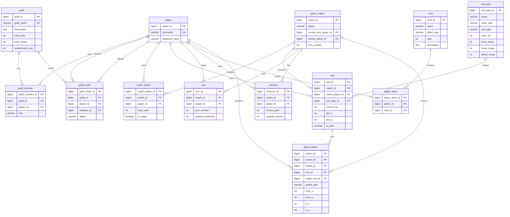

# Runebound Tactic — Database Design

## Overview

The database is designed to support the core systems of **Runebound Tactic**, a multiplayer turn-based tactical strategy game. The schema handles player accounts, guild/clan systems, matchmaking, turn management, units, resources, cards, and gameplay action logging. The design is normalized to reduce redundancy while keeping multiplayer state consistent.

---

# Entity Relationship Diagram (ERD)

---

# Table Specifications

## player

Stores each player's account.

Example:

| player_id | username | password_hash |
| --------- | -------- | ------------- |
| 1         | Alex     | hashed_pw     |
| 2         | Ryan     | hashed_pw     |

Used for login, identity, match participation, guild membership, and ownership of units/resources.

---

## guild

Stores guild/clan information.

Example:

| guild_id | guild_name    | description       | total_wins | total_losses | leaderboard_rank |
| -------- | ------------- | ----------------- | ---------- | ------------ | ---------------- |
| 1        | DragonKnights | Competitive guild | 50         | 10           | 1                |

Used for clan membership, guild stats, and leaderboard ranking.

---

## guild_member

Connects players to guilds.

Columns:

* `guild_id` → which guild
* `player_id` → member
* `role` → leader / officer / member

Example:

| guild_member_id | guild_id | player_id | role   |
| --------------- | -------- | --------- | ------ |
| 1               | 1        | 1         | leader |

Used to know who belongs to what guild.

---

## guild_invite

Stores pending guild invitations or join requests.

Columns:

* `guild_id` → inviting guild
* `player_id` → invited player
* `initiated_by` → sender
* `status` → pending / accepted / rejected

Example:

| guild_invite_id | guild_id | player_id | initiated_by | status  |
| --------------- | -------- | --------- | ------------ | ------- |
| 1               | 1        | 2         | 1            | pending |

Used for invite workflows before adding to guild_member.

---

## game_match

Stores one game session.

Columns:

* `status` → waiting / active / finished
* `current_turn_player_id` → whose turn
* `winner_player_id` → winner
* `turn_number` → current round

Example:

| match_id | status | current_turn_player_id | winner_player_id | turn_number |
| -------- | ------ | ---------------------- | ---------------- | ----------- |
| 101      | active | 1                      | NULL             | 4           |

Used as the parent record for the whole match.

---

## match_player

Links players to a match.

Columns:

* `team_side` → 1 or 2
* `is_ready` → ready state before match start

Example:

| match_player_id | match_id | player_id | team_side | is_ready |
| --------------- | -------- | --------- | --------- | -------- |
| 1               | 101      | 1         | 1         | true     |
| 2               | 101      | 2         | 2         | true     |

Used to determine participants and teams.

---

## unit_type

Stores predefined unit definitions.

Example:

| unit_type_id | name   | class_type | role_type | base_hp | base_attack | move_range | attack_range |
| ------------ | ------ | ---------- | --------- | ------- | ----------- | ---------- | ------------ |
| 1            | Archer | range      | pawn      | 70      | 20          | 2          | 3            |

Used as templates for units.

---

## unit

Stores live units in battle.

Example:

| unit_id | match_id | owner_player_id | unit_type_id | current_hp | pos_x | pos_y | is_alive |
| ------- | -------- | --------------- | ------------ | ---------- | ----- | ----- | -------- |
| 1001    | 101      | 1               | 1            | 70         | 2     | 5     | true     |

Used to draw the board and track unit state.

---

## turn

Tracks turn ownership and remaining actions.

Example:

| turn_id | match_id | player_id | turn_number | actions_remaining |
| ------- | -------- | --------- | ----------- | ----------------- |
| 1       | 101      | 1         | 4           | 2                 |

Used to enforce turn-based gameplay.

---

## resource

Stores player gold during a match.

Example:

| resource_id | match_id | player_id | current_gold | passive_income |
| ----------- | -------- | --------- | ------------ | -------------- |
| 1           | 101      | 1         | 30           | 5              |

Used for spawning units and playing cards.

---

## card

Stores card definitions.

Example:

| card_id | name    | effect_type | cost | description              |
| ------- | ------- | ----------- | ---- | ------------------------ |
| 1       | Reflect | defense     | 10   | Reflects incoming damage |

Used as the master list of all cards.

---

## player_deck

Stores which cards a player selected.

Example:

| player_deck_id | player_id | card_id |
| -------------- | --------- | ------- |
| 1              | 1         | 1       |

Used to determine what cards are available in battle.

---

## game_action

Stores gameplay history.

Columns:

* `unit_id` → acting unit
* `target_unit_id` → attacked target (NULL if move)
* `action_type` → move / attack / card / end_turn
* `from_x, from_y` → old position
* `to_x, to_y` → new position

Example:

| action_id | match_id | player_id | unit_id | target_unit_id | action_type | from_x | from_y | to_x | to_y |
| --------- | -------- | --------- | ------- | -------------- | ----------- | ------ | ------ | ---- | ---- |
| 1         | 101      | 1         | 1001    | NULL           | move        | 2      | 5      | 3    | 5    |
| 2         | 101      | 1         | 1001    | 2001           | attack      | 3      | 5      | 3    | 5    |

Used for logging moves, attacks, and debugging match state.
